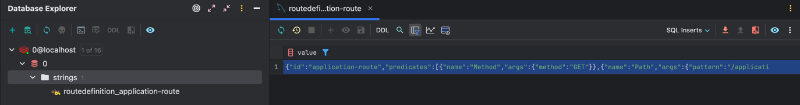

# 06. Dynamic Routing... #4 - Implementation - RedisRouteDefinitionRepository

이번에는 레디스에 지정된 Routing 정보를 저장하고 불러오도록 해보자. 

## Dependency 추가

```groovy

dependencies {
    implementation 'org.springframework.boot:spring-boot-starter-data-redis-reactive'
    implementation 'org.springframework.cloud:spring-cloud-starter-gateway'
    compileOnly 'org.projectlombok:lombok'
    annotationProcessor 'org.projectlombok:lombok'
    testImplementation 'org.springframework.boot:spring-boot-starter-test'
    testImplementation 'io.projectreactor:reactor-test'
    testRuntimeOnly 'org.junit.platform:junit-platform-launcher'
}

dependencyManagement {
    imports {
        mavenBom "org.springframework.cloud:spring-cloud-dependencies:${springCloudVersion}"
    }
}
```

먼저 `spring-boot-starter-data-redis-reactive` 의존성을 추가한다. 이렇게 되면 RedisTemplate 을 사용할 수 있게 된다 아래의 코드를 보자

```java
@Configuration(
    proxyBeanMethods = false
)
@AutoConfigureAfter({RedisReactiveAutoConfiguration.class})
@AutoConfigureBefore({GatewayAutoConfiguration.class})
@ConditionalOnBean({ReactiveRedisTemplate.class})
@ConditionalOnClass({RedisTemplate.class, DispatcherHandler.class})
@ConditionalOnProperty(
    name = {"spring.cloud.gateway.redis.enabled"},
    matchIfMissing = true
)
class GatewayRedisAutoConfiguration {
    GatewayRedisAutoConfiguration() {
    }

    @Bean
    public RedisScript redisRequestRateLimiterScript() {
        DefaultRedisScript redisScript = new DefaultRedisScript();
        redisScript.setScriptSource(new ResourceScriptSource(new ClassPathResource("META-INF/scripts/request_rate_limiter.lua")));
        redisScript.setResultType(List.class);
        return redisScript;
    }

    @Bean
    @ConditionalOnMissingBean
    public RedisRateLimiter redisRateLimiter(ReactiveStringRedisTemplate redisTemplate, @Qualifier("redisRequestRateLimiterScript") RedisScript<List<Long>> redisScript, ConfigurationService configurationService) {
        return new RedisRateLimiter(redisTemplate, redisScript, configurationService);
    }

    @Bean
    @ConditionalOnProperty(
        value = {"spring.cloud.gateway.redis-route-definition-repository.enabled"},
        havingValue = "true"
    )
    @ConditionalOnClass({ReactiveRedisTemplate.class})
    public RedisRouteDefinitionRepository redisRouteDefinitionRepository(ReactiveRedisTemplate<String, RouteDefinition> reactiveRedisTemplate) {
        return new RedisRouteDefinitionRepository(reactiveRedisTemplate);
    }

    @Bean
    public ReactiveRedisTemplate<String, RouteDefinition> reactiveRedisRouteDefinitionTemplate(ReactiveRedisConnectionFactory factory) {
        StringRedisSerializer keySerializer = new StringRedisSerializer();
        Jackson2JsonRedisSerializer<RouteDefinition> valueSerializer = new Jackson2JsonRedisSerializer(RouteDefinition.class);
        RedisSerializationContext.RedisSerializationContextBuilder<String, RouteDefinition> builder = RedisSerializationContext.newSerializationContext(keySerializer);
        RedisSerializationContext<String, RouteDefinition> context = builder.value(valueSerializer).build();
        return new ReactiveRedisTemplate(factory, context);
    }
}

```

`GatewayRedisAutoConfiguration` 에서 `@Bean` 으로 `RedisRouteDefinitionRepository` 를 생성게 되며  Redis 를 이용해서 RouteDefinition 을 사용할 수 있게 된다. 이제 본격적으로 Redis 에 RouteDefinition 을 저장하고 불러오는 코드를 작성해보자.

## Spring Cloud Gateway Redis 구성

Redis 를 구성하기위해서 application.yaml 을 아래와 같이 작성하겠다. 

```yaml
spring:
  application:
    name: gateway-redis
  cloud:
    gateway:
      redis-route-definition-repository:
        enabled: true 
  data:
    redis:
      host: localhost
      port: 6379

server:
  port: 8082
```

이때 아래의 두 설정을 필수로 해주어야 한다. 

- `spring.cloud.gateway.redis-route-definition-repository.enabled` : true 로 설정해야 RedisRouteDefinitionRepository 가 활성화 된다.
- `spring.data.redis` : Redis 서버의 정보를 설정

이제 Route 를 등록하고 조회하는 코드를 작성해보자

## Dynamic Routing Application 구현

### RedisGatewayRoutingService
```java
import jakarta.validation.constraints.NotNull;
import lombok.RequiredArgsConstructor;
import lombok.extern.slf4j.Slf4j;
import org.springframework.cloud.gateway.event.RefreshRoutesEvent;
import org.springframework.cloud.gateway.route.Route;
import org.springframework.cloud.gateway.route.RouteDefinition;
import org.springframework.cloud.gateway.route.RouteDefinitionLocator;
import org.springframework.cloud.gateway.route.RouteDefinitionWriter;
import org.springframework.cloud.gateway.route.RouteLocator;
import org.springframework.context.ApplicationEventPublisher;
import org.springframework.context.ApplicationEventPublisherAware;
import org.springframework.stereotype.Service;
import reactor.core.publisher.Flux;
import reactor.core.publisher.Mono;

@Slf4j
@Service
@RequiredArgsConstructor
public class RedisGatewayRoutingService implements ApplicationEventPublisherAware {
    private final RouteDefinitionWriter routeDefinitionWriter;
    private final RouteDefinitionLocator routeDefinitionLocator;
    private final RouteLocator routeLocator;
    private ApplicationEventPublisher publisher;

    public Mono<Void> addRoute(@NotNull RouteDefinition route) {
        Mono<RouteDefinition> mono = Mono.just(route);
        return routeDefinitionWriter.save(mono).then(Mono.defer(() -> {
            publisher.publishEvent(new RefreshRoutesEvent(this));
            return Mono.empty();
        }));
    }

    public Flux<RouteDefinition> getRoutesDefinitions() {
        return routeDefinitionLocator.getRouteDefinitions();
    }

    public Flux<Route> getRoutes() {
        return this.routeLocator.getRoutes();
    }

    @Override
    public void setApplicationEventPublisher(ApplicationEventPublisher applicationEventPublisher) {
        this.publisher = applicationEventPublisher;
    }
}
```

이를 호출하는 Controller 를 작성해보자

### RedisGatewayRoutingController
```java
@Slf4j
@RestController
@RequestMapping("/v1/routes/redis")
@RequiredArgsConstructor
public class RedisGatewayRoutingController {
    private final RedisGatewayRoutingService redisGatewayRoutingService;
    private final RouteInformationFunction routeInformationFunction;

    @PostMapping
    public Mono<Void> routeDefinitionFlux(@RequestBody RouteDefinition route) {
        return redisGatewayRoutingService.addRoute(route);
    }

    @GetMapping
    public Flux<RouteDefinition> getRouteDefinitions() {
        return redisGatewayRoutingService.getRoutesDefinitions();
    }

    @GetMapping("/route")
    public Flux<Map<String, Object>> getRoutes() {
        return redisGatewayRoutingService.getRoutes().map(this.routeInformationFunction);
    }
}
```

```RouteInformationFunction```  은 route 정보의 filter 를 읽을수 있는 형태로 parsing 하는 함수이다.

이제 작성을 완료했으니 테스트를 해보자.

## Test

### Route 등록

```http request
POST /v1/routes/redis
Content-Type: application/json
Host: localhost:8082

{
  "id": "application-route",
  "uri": "http://localhost:8080",
  "predicates": [
    {
      "name": "Path",
      "args": {
        "pattern": "/application/**"
      }
    }
  ],
  "filters": [
    {
      "name": "RewritePath",
      "args": {
        "regexp": "/application/(?<segment>.*)",
        "replacement": "/v1/application/${segment}"
      }
    }
  ]
}
```

### Route 조회

```http request
GET /v1/routes/redis
Host: localhost:8082

HTTP/1.1 200 OK
transfer-encoding: chunked
Content-Type: application/json

[
  {
    "id": "application-route",
    "predicates": [
      {
        "name": "Path",
        "args": {
          "pattern": "/application/**"
        }
      }
    ],
    "filters": [
      {
        "name": "RewritePath",
        "args": {
          "regexp": "/application/(?<segment>.*)",
          "replacement": "/v1/application/${segment}"
        }
      }
    ],
    "uri": "http://localhost:8080",
    "metadata": {},
    "order": 0
  }
]
```

이제 생성된 라우터를 통해 요청을 보내보겠다.

```http request
### 등록된 route에 대해서 요청 테스트
GET /application/hello
Host: localhost:8081
Content-Type: application/json

HTTP/1.1 200 OK
Content-Type: text/plain;charset=UTF-8
Content-Length: 18
Date: Tue, 03 Dec 2024 06:50:11 GMT

application: hello

Response code: 200 (OK); Time: 358ms (358 ms); Content length: 18 bytes (18 B)
```
 
기대하는 결과가 정상적으로 출력된것을 확인 가능하다.

자 정말 redis 에 저장이 잘 되어있는지 확인해보자 



## 마치며

이번 챕터를 읽어보면 이전 챕터와 별 차이 없다는것을 알 수 있다. 사실 코드의 차이에는 큰 변화가 없다. 단지 Redis를 활용해서 저장하는 위치를 관리할 뿐 

곧 프로젝트를 진행해야하는데 아직 부족한 부분이 많다.. 내용 정리해볼 것을 밑에 적어보겠다 

1. Request/Response Body 의 Parsing 
   - 필드 parsing policy 
   - 필드 validation policy
   - 필드 mapping policy
   - xml to json & json to xml

2. Load Balancer
   - Round Robin
   - Weighted Response Time
   - Least Connection
   - Consistent Hashing
   - Random
   - IP Hash
   - URL Hash
   - Sticky Session

3. Circuit Breaker
4. Rate Limiter
5. Retry
6. Caching

일단 Spring Cloud Gateway 는 위에 있는 내용을 먼저 정리가 필요할 것 같다. 그외 다른 내용들도 정리가 필요할 것 같다.

1. Redis 
2. Spring WebFlux

위 두가지는 사용하면서 공부를 할 예정이지만 Redis 는 먼저 학습을 해놔야할 것 같다. 

이번 챕터는 여기까지 하겠다. 다음 챕터에서는 Load Balancer 에 대해서 알아보겠다. 

- [이전: 05. Dynamic Routing... #3 - Implementation - InMemoryRouteDefinitionRepository](./dynamic-routing_3.md)
- [다음: 07. Response Body Parsing](../parsing.md)